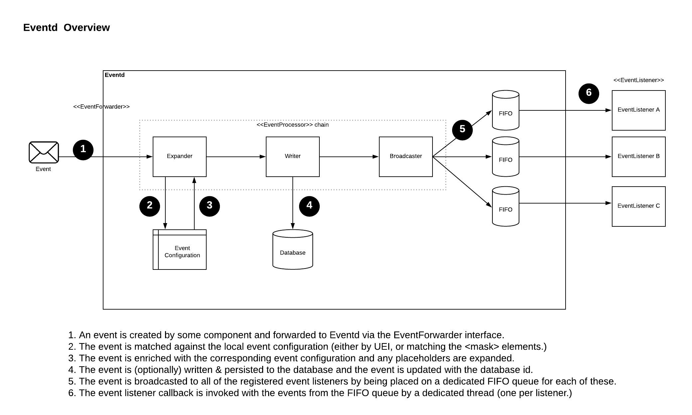

# Events

## Goal

Understand how events are modeled, how eventd works and what APIs used used to send and receive events.

## Lecture

TODO: Eventconf and pre-processing

TODO: Review how patterns are optimized i.e. create transaction or not

## Lab

TODO: Extend eventconf w/ OIA and send an event, debug w/ breakpoints to understand process
