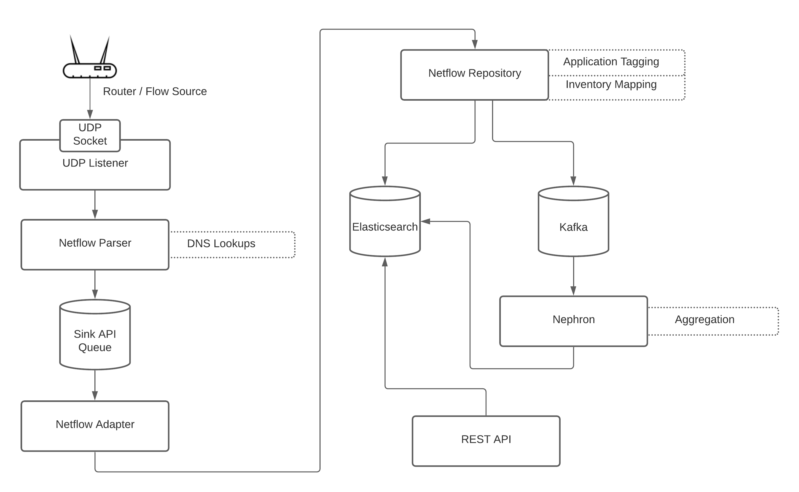

#  Flows

## Goal

Understand how OpenNMS implements support for flows.

## Overview

Network flows are summaries of IP traffic that can be used to help understand bandwidth usage and patterns.

Flows come in many flavors including Netflow v5, Netflow v9, IPFIX and sFlow.

OpenNMS is able to decode these protocols and reduce the flow representations to a canonical model: [flowdocument.proto](https://github.com/OpenNMS/opennms/blob/opennms-26.2.2-1/features/flows/kafka-persistence/src/main/proto/flowdocument.proto#L47)

OpenNMS is able to enrich flows with inventory information, MIB-2 data, and application tags.

Application tags are computed from classification rules which can be configured to match IP addresses, port numbers or flow exporters.
A default set of rules are provided to match common and known applications.

> The classification rules allow you to define your own applications i.e. if you see traffic on this port, between these hosts, at this location, then tag the flows with the "Nightly-Backup" application.

The flow processing pipeline is built on top of telemetryd.
By leveraging telemtryd, flows can be handled in different configurations and system architectures based on requirements and flow volume.
Flows are stored exclusively in Elasticsearch.

OpenNMS provides a REST API that can be used to retrieve statistics from flow records.
The REST API performs asynchronous queries to Elasticsearch and offloads the computation to the Elasticsearch engine.
Grafana and the OpenNMS Helm plugin are used for visualizing flows.

Flows records tend to have high cardinality (a lot of unique IP addresses and ports) and queries can get resource intensive for large datasets.
In order to pre-compute the statistics and reduce the data rentention requirements, the [Nephron](https://github.com/OpenNMS/nephron) stream processing pipeline can be used.
Nephron is built on [Apache Beam](https://beam.apache.org/) which allows the pipeline to be run on various engines including [Apache Flink](https://flink.apache.org/).

## Flow Pipeline

Let's walk through the flow  pipeline to better understand how flows are processed:

Routers, or other flow collectors, send flow packets to a listening socket.
Listeners are supported on either Minion or OpenNMS.

> The diagram depicts a UDP socket, but TCP is also supported when using Netflow v9 or IPFIX.

The flow packets are then decoded by a chain of parsers, each with knowledge of a specific protocol i.e. Netflow v5, Netflow v9, IPFIX, sFlow.
After being decoded, the flow records are also enriched with the result of reverse DNS lookups for the associated addresses.

> Reverse DNS lookups are performed in the parser since the accuracy of results may depend on talking to local DNS servers that are only reachable from the Minion perspective.

The resulting flow records are then enqueued via the Sink API and are expected to be consumed by the adapter.
The adapter is responsible for converting the protocol specific flow record to a canonical flow record that is common to all protocols.

> Adapters are supported on either OpenNMS or Sentinel.

The flow repository will then perform further enrichment on the flow record [associating the flow with known entities](https://github.com/OpenNMS/opennms/blob/opennms-26.2.2-1/features/flows/elastic/src/main/java/org/opennms/netmgt/flows/elastic/DocumentEnricher.java#L130) and [tagging the application using the classification API](https://github.com/OpenNMS/opennms/blob/opennms-26.2.2-1/features/flows/elastic/src/main/java/org/opennms/netmgt/flows/elastic/DocumentEnricher.java#L152).

Listener -> Parser -> Queue -> Sink API
* Look at topic
* Look at payload

Things to cover:
1. Sink API
1. Sentinel
1. Adapter
1. Proto on Kafka
1. Nephron
1. Elasticsearch
1. REST API
1. Helm

## Lab

TODO: Synthetic Flows
* Generate some known flow pattern using Riptide
* git clone https://github.com/opennms-forge/opennms-riptide

TODO: Should be a wget of a jar

TODO: Also push time series via Graphite

TODO: Be able to do this over the opennms-demo environment
