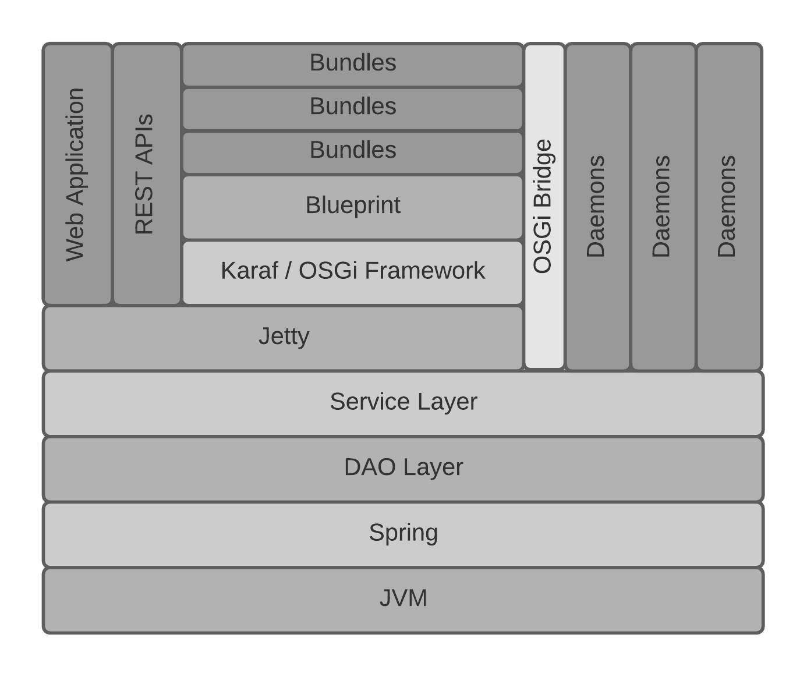
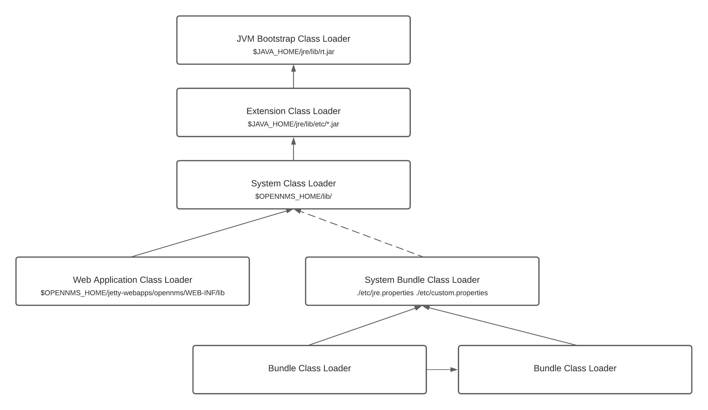
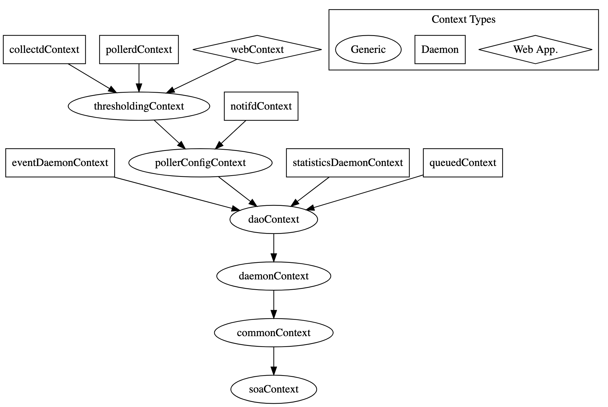

# JVM Architecture

## Goal

Understand the OpenNMS JVM architecture.

## Components

### Overview

The major components of the OpenNMS JVM are structured as follows:



The majority of services and functions developed before 2015 were in the form of "daemons", whereas much of the more modern code has been developed as "bundles".

### Spring

OpenNMS Horizon 26.2.2 uses [Spring 4.2.9](https://github.com/OpenNMS/opennms/blob/opennms-26.2.2-1/pom.xml#L1473) as an IoC container.
The DAO layer, the daemons, and most of the supporting services are wired through Spring contexts as demonstrated in the startup walkthrough below.

### DAO Layer

The DAO layer is a collection of beans and services used to access configuration files and interact with database entities.
Each configuration file and database entity tends to have its own specific DAO interface.

For database interaction we use Hibernate as an ORM, Spring for transaction management, and [HikariCP](https://github.com/brettwooldridge/HikariCP) for connection pooling.
Some legacy code uses direct SQL queries and does not leverage Hibernate entities.

### Daemons

Daemons are individual services provided in the platform.
Each daemon has its own definition in [service-configuration.xml](https://github.com/OpenNMS/opennms/blob/opennms-26.2.2-1/opennms-base-assembly/src/main/filtered/etc/service-configuration.xml), its own configuration, its own thread pools, and its own scheduling mechanisms.

Daemons tend to communicate with one another by sending events over the event bus (managed by the eventd daemon).
Shared services tend to be maintained in the DAO layer, but daemons can make services available globally by exposing them in the OSGi registry.

Daemons include: eventd, pollerd, collectd, telemetryd, provisiond, discoveryd, etc.

### Jetty

The Jetty HTTP server is defined as a daemon, but is worth mentioning separately since it hosts the web application, REST API, and is used to bootstrap Karaf.

Jetty's configuration is pulled from the classpath by default, but can be overridden by defining `./etc/jetty.xml`.
A copy of the default configuration is maintained in [./etc/examples/jetty.xml](https://github.com/OpenNMS/opennms/blob/opennms-26.2.2-1/opennms-jetty/src/main/resources/org/opennms/netmgt/jetty/jetty.xml).

> Jetty can be configured to terminate SSL, or you can front Jetty with a reverse proxy.

Web applications are automatically loaded from `./jetty-webapps`.
The REST API, static assets, servlets, and JSPs are all served from the `opennms` web application.

> Third-party applications like [hawtio](https://hawt.io/) can be easily deployed by dropping the `.war`, or extracting its contents in a new folder in `./jetty-webapps`.

As mentioned in the startup process walkthrough below, the Karaf container is started when the `opennms` web application is initialized.

### Web Application

The web application is defined in the source tree in both the `opennms-webapp` and `opennms-webapp-rest` modules.
The `web.xml` files and artifacts from these are merged at assembly time using our [warmerge plugin](https://github.com/OpenNMS/maven-plugins/tree/features-maven-plugin-1.3.2/opennms-warmerge-plugin).

Spring Security performs authentication and authorization in the web application.
See [applicationContext-spring-security.xml](https://github.com/OpenNMS/opennms/blob/opennms-26.2.2-1/opennms-webapp/src/main/webapp/WEB-INF/applicationContext-spring-security.xml#L126) for details.

### Karaf

Horizon 26.2.2 uses [Karaf 4.2.6](https://github.com/OpenNMS/opennms/blob/opennms-26.2.2-1/pom.xml#L1415) as an OSGi container.
In order to incorporate Karaf into our existing stack we have customized the default distribution.

We have implemented a [custom service registry](https://github.com/OpenNMS/opennms/blob/opennms-26.2.2-1/core/soa/src/main/java/org/opennms/core/soa/support/OnmsOSGiBridgeActivator.java#L44) that allows services to be exposed or referenced between the OSGi registry and Spring contexts.
We have implemented a [custom web bridge](https://github.com/OpenNMS/opennms/tree/opennms-26.2.2-1/container/web) that allows servlets, filters, and JAX-RS annotated interfaces to be exposed from OSGi-based services and made accessible through the existing `opennms` web application.
We have a [custom JAAS provider](https://github.com/OpenNMS/opennms/blob/opennms-26.2.2-1/container/jaas-login-module/src/main/resources/OSGI-INF/blueprint/blueprint.xml#L13) that allows Karaf to use the same authentication subsystem that the web application uses.
We also make heavy use of Karaf shell commands for interacting with the system at runtime.

### OSGi and Class Loaders

Class loaders in the OpenNMS JVM are organized as follows:


The system class loader contains all of the artifacts present in `$OPENNMS_HOME/lib`.
Jetty creates a separate class loader for each web application.
Karaf creates its own system class loader that exposes classes from the parent class loaders depending on what's configured in `jre.properties` and `custom.properties`.
Each bundle has its own class loader, which may be linked with or reference classes in other bundles using OSGi constructs.

## Startup Process

In order to better understand the various components in the OpenNMS JVM, it is particularly useful to understand the startup and bootstrap process.

### 0) Walkthrough using the debugger

Here's how to use a debugger to step through the startup process.

First, let's look at the Java command line executed by the startup script:
```
sudo bash -x ./bin/opennms -t start
```

We see the following command:
```
runCmd /home/vagrant/git/opennms/target/opennms-26.2.2/bin/runjava -r -- -Djava.endorsed.dirs=/home/vagrant/git/opennms/target/opennms-26.2.2/lib/endorsed -Dopennms.pidfile=/home/vagrant/git/opennms/target/opennms-26.2.2/logs/opennms.pid -agentlib:jdwp=transport=dt_socket,server=y,address=8001,suspend=n -Dopennms.home=/home/vagrant/git/opennms/target/opennms-26.2.2 -Xmx2048m -XX:+HeapDumpOnOutOfMemoryError -Dcom.sun.management.jmxremote.authenticate=true -Dcom.sun.management.jmxremote.login.config=opennms -Dcom.sun.management.jmxremote.access.file=/home/vagrant/git/opennms/target/opennms-26.2.2/etc/jmxremote.access -DisThreadContextMapInheritable=true -Dgroovy.use.classvalue=true -XX:MaxMetaspaceSize=512m -Djava.io.tmpdir=/home/vagrant/git/opennms/target/opennms-26.2.2/data/tmp -XX:+StartAttachListener -jar /home/vagrant/git/opennms/target/opennms-26.2.2/lib/opennms_bootstrap.jar start
```

In particular, we see that the main class in the `opennms_bootstrap.jar` is being executed.
Inspecting the .jar reveals that we are calling `org.opennms.bootstrap.Bootstrap`.

In Eclipse, we can then import the `opennms-bootstrap` modules from the `./opennms-bootstrap` folder.

Set a breakpoint on line 472: `final file opennmsHome = findOpenNMSHome();`

Edit `./bin/opennms` and change `suspend=n` to `suspend=y` on line 413.

Start OpenNMS: `sudo ./bin/opennms -t start`

Connect using the debugger and expect our breakpoint to be hit.

We are now able to walk through the startup process.

### 1) Bootstrapping

1. The `Bootstrap` class invoked from the command line calls out the `main` method of the `org.opennms.netmgt.vmmgr.Controller` class via reflection.
   * [See Bootstrap.java#L479](https://github.com/OpenNMS/opennms/blob/opennms-26.2.2-1/opennms-bootstrap/src/main/java/org/opennms/bootstrap/Bootstrap.java#L479)
1. The `Controller` class invokes `Starter#startDaemon`
   * [See Controller.java#L171](https://github.com/OpenNMS/opennms/blob/opennms-26.2.2-1/core/daemon/src/main/java/org/opennms/netmgt/vmmgr/Controller.java#L171)
1. The `Starter` class loads the list of services from `etc/service-configuration.xml`.
   * [See Starter.java#L150 ](https://github.com/OpenNMS/opennms/blob/opennms-26.2.2-1/core/daemon/src/main/java/org/opennms/netmgt/vmmgr/Starter.java#L150)
1. The `Starter` class instantiates the classes, exposes MBeans for these, and invokes methods as listed in `etc/service-configuration.xml`.

The flexibility of the service configuration XML file has allowed the bootstrapping code to remain mostly unchanged throughout the evolution of OpenNMS.
Modifications are normally made only to the service configuration XML and to the classes it references.

### 2) Spring

In order to understand the next stage of the startup process, we'll dive a little deeper into what happens when a particular service is initialized.

Let's take the the `eventd` service as defined in `service-configuration.xml` as follows:
```
<service>
  <name>OpenNMS:Name=Eventd</name>
  <class-name>org.opennms.netmgt.eventd.jmx.Eventd</class-name>
  <invoke method="init" pass="0" at="start"/>
  <invoke method="start" pass="1" at="start"/>
  <invoke method="status" pass="0" at="status"/>
  <invoke method="stop" pass="0" at="stop"/>
</service>
```

During startup, we first (at pass=0) call `org.opennms.netmgt.eventd.jmx.Eventd#init` and then subsequently call `org.opennms.netmgt.eventd.jmx.Eventd#start`.

The `org.opennms.netmgt.eventd.jmx.Eventd` extends `org.opennms.netmgt.daemon.AbstractSpringContextJmxServiceDaemon` and most of the logic is implemented in this base class.

The call to `BeanUtils#getFactory` ends up loading the `eventDaemonContext` defined in `classpath*:/beanRefContext.xml`. This depends on the `daoContext`, which also gets in a similar fashion:
```
<bean id="eventDaemonContext" class="org.springframework.context.support.ClassPathXmlApplicationContext">
   <constructor-arg>
      <list>
      <value>META-INF/opennms/applicationContext-eventDaemon.xml</value>
      <value>META-INF/opennms/applicationContext-daoEvents.xml</value>
      </list>
   </constructor-arg>
   <constructor-arg ref="daoContext" />
</bean>
```

The hierarchy of Spring contexts looks like:


Contexts are able to access beans defined specifically in that context, or in any parent contexts.

> When a context is loaded, its parents will be recursively loaded, which means that a large part of the initialization will happen when the first daemon starts and loads an application context.


### 3) Jetty & Karaf

The service entry in `service-configuration.xml` for Jetty looks like:
```
<service>
   <name>OpenNMS:Name=JettyServer</name>
   <class-name>org.opennms.netmgt.jetty.jmx.JettyServer</class-name>
   <invoke method="init" pass="0" at="start"/>
   <invoke method="start" pass="1" at="start"/>
   <invoke method="status" pass="0" at="status"/>
   <invoke method="stop" pass="0" at="stop"/>
</service>
```

On start, this class loads the `jettyServerContext`, which fires up Jetty and launches any web applications found in `$OPENNMS_HOME/jetty-webapps/`.

If we inspect the `web.xml` from the primary web application in `jetty-webapps/opennms/WEB-INF/web.xml` we find:
```
<listener>
   <listener-class>org.opennms.container.web.WebAppListener</listener-class>
</listener>

<listener>
   <listener-class>org.apache.felix.http.proxy.ProxyListener</listener-class>
</listener>
```

The `org.opennms.container.web.WebAppListener#contextInitialized` is called when the web application is initialized, and the following code starts Karaf via the `org.apache.karaf.main.Main` class:
```
System.setProperty("karaf.startRemoteShell", "true");
System.setProperty("karaf.lock", "false");
main = new Main(new String[0]);
main.launch();
```

Karaf will go through its own startup process and load the features defined in [./etc/org.apache.karaf.features.cfg](https://github.com/OpenNMS/opennms/blob/opennms-26.2.2-1/container/karaf/src/main/filtered-resources/etc/org.apache.karaf.features.cfg#L64).
These include:
```
datachoices, \
opennms-activemq-shell, \
opennms-collection-commands, \
opennms-core-ipc-rpc-commands, \
opennms-core-ipc-kafka-shell, \
opennms-dhcpd, \
opennms-events-commands, \
opennms-send-event-command, \
opennms-identity, \
opennms-icmp-commands, \
opennms-snmp-commands, \
opennms-telemetry-collection,\
opennms-telemetry-bmp,\
opennms-telemetry-jti,\
opennms-telemetry-nxos,\
opennms-telemetry-graphite,\
opennms-telemetry-openconfig, \
opennms-dnsresolver-shell,\
opennms-dnsresolver-netty,\
opennms-flows,\
opennms-topology-runtime-browsers,\
opennms-topology-runtime-linkd,\
```

Features are defined in XML and may contain references to other features or bundles (JARs with additional OSGi meta-data) - see [features.xml](https://github.com/OpenNMS/opennms/blob/opennms-26.2.2-1/container/features/src/main/resources/features.xml#L1462).
The Karaf container is made aware of feature by defining [feature repository entries](https://github.com/OpenNMS/opennms/blob/opennms-26.2.2-1/container/karaf/src/main/filtered-resources/etc/org.apache.karaf.features.cfg#L38).

When a feature is loaded, all its dependent features and bundles are loaded.
Bundles may use [activators](https://github.com/OpenNMS/opennms/blob/opennms-26.2.2-1/container/spring-extender/pom.xml#L26) or [blueprints](https://github.com/OpenNMS/opennms/blob/opennms-26.2.2-1/features/flows/elastic/src/main/resources/OSGI-INF/blueprint/blueprint.xml#L70) to perform additional wiring or logic when loaded.
