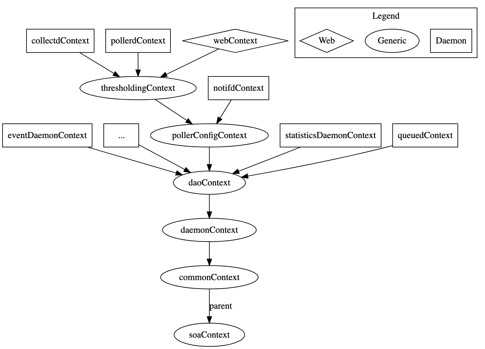

# JVM Architecture

## Goal

Understand the architecture of the OpenNMS JVM.

## Startup Process

In order to better understand the various components in the OpenNMS JVM, it is particularly useful to understand the startup and bootstrap process.

### 0) Walkthrough using the debugger

Here's how to use a debugger to step through the startup process.

First, let's look at the Java command line executed by the startup script:
```
sudo bash -x ./bin/opennms -t start
```

We see the following command:
```
runCmd /home/vagrant/git/opennms/target/opennms-26.2.2/bin/runjava -r -- -Djava.endorsed.dirs=/home/vagrant/git/opennms/target/opennms-26.2.2/lib/endorsed -Dopennms.pidfile=/home/vagrant/git/opennms/target/opennms-26.2.2/logs/opennms.pid -agentlib:jdwp=transport=dt_socket,server=y,address=8001,suspend=n -Dopennms.home=/home/vagrant/git/opennms/target/opennms-26.2.2 -Xmx2048m -XX:+HeapDumpOnOutOfMemoryError -Dcom.sun.management.jmxremote.authenticate=true -Dcom.sun.management.jmxremote.login.config=opennms -Dcom.sun.management.jmxremote.access.file=/home/vagrant/git/opennms/target/opennms-26.2.2/etc/jmxremote.access -DisThreadContextMapInheritable=true -Dgroovy.use.classvalue=true -XX:MaxMetaspaceSize=512m -Djava.io.tmpdir=/home/vagrant/git/opennms/target/opennms-26.2.2/data/tmp -XX:+StartAttachListener -jar /home/vagrant/git/opennms/target/opennms-26.2.2/lib/opennms_bootstrap.jar start
```

In particular, we see that the main class in the `opennms_bootstrap.jar` is being executed.
Inspecting the .jar reveals that we are calling `org.opennms.bootstrap.Bootstrap`.

In Eclipse, we can them import the `opennms-bootstrap` modules from the `./opennms-bootstrap` folder.

Set a breakpoint on line 472: `final file opennmsHome = findOpenNMSHome();`

Edit `./bin/opennms` and change `suspend=n` to `suspend=y` on line 413.

Start OpenNMS: `sudo ./bin/opennms -t start`

Connect using the debugger and expect our breakpoint to be hit.

We are now able to walk through the startup process.

### 1) Bootstrapping

1. The `Bootstrap` class invoked from the command line calls out `main` method of the `org.opennms.netmgt.vmmgr.Controller` class via reflection.
   * [See Bootstrap.java#L479](https://github.com/OpenNMS/opennms/blob/opennms-26.2.2-1/opennms-bootstrap/src/main/java/org/opennms/bootstrap/Bootstrap.java#L479)
1. The `Controller` class invokes `Starter#startDaemon`
   * [See Controller.java#L171](https://github.com/OpenNMS/opennms/blob/opennms-26.2.2-1/core/daemon/src/main/java/org/opennms/netmgt/vmmgr/Controller.java#L171)
1. The `Starter` class loads the list of services from `etc/service-configuration.xml`.
   * [See Starter.java#L150 ](https://github.com/OpenNMS/opennms/blob/opennms-26.2.2-1/core/daemon/src/main/java/org/opennms/netmgt/vmmgr/Starter.java#L150)
1. The `Starter` class instantiates the classes, exposes MBeans for these, and invokes methods as listed in `etc/service-configuration.xml`.

The flexibility of the service configuration XML file has allow the bootstrapping code to remain mostly unchanged throughout the evolution of OpenNMS.
Modifications are normally only make to the to the service configuration XML and to the classes it references.

### 2) Spring

In order to understand the next stage of the startup process, we'll dive a little deeper into what happens when a particular service is initialized.

Let's take the the `eventd` service as defined in `service-configuration.xml` as follows:
```
<service>
  <name>OpenNMS:Name=Eventd</name>
  <class-name>org.opennms.netmgt.eventd.jmx.Eventd</class-name>
  <invoke method="init" pass="0" at="start"/>
  <invoke method="start" pass="1" at="start"/>
  <invoke method="status" pass="0" at="status"/>
  <invoke method="stop" pass="0" at="stop"/>
</service>
```

During startup, we first (at pass=0) call `org.opennms.netmgt.eventd.jmx.Eventd#init` and then subsequently call `org.opennms.netmgt.eventd.jmx.Eventd#start`.

The `org.opennms.netmgt.eventd.jmx.Eventd` extends `org.opennms.netmgt.daemon.AbstractSpringContextJmxServiceDaemon` and most of the logic is implemented in this base class.

The call to `BeanUtils#getFactory` ends up loading the `eventDaemonContext` defined in `classpath*:/beanRefContext.xml`. This depends on the `daoContext`, which also gets in a similar fashion:
```
<bean id="eventDaemonContext" class="org.springframework.context.support.ClassPathXmlApplicationContext">
   <constructor-arg>
      <list>
      <value>META-INF/opennms/applicationContext-eventDaemon.xml</value>
      <value>META-INF/opennms/applicationContext-daoEvents.xml</value>
      </list>
   </constructor-arg>
   <constructor-arg ref="daoContext" />
</bean>
```

The hiearchy of Spring contexts looks like:


Contexts are able to access beans defined specifically in that context, or in any parent contexts.

> When a context is loaded, it's parents will be recursively loaded, which means that a large part of the initialization will happen when the first daemon starts and loads an application context.


### 3) Jetty & Karaf

The service entry in `service-configuration.xml` for Jetty looks like:
```
<service>
   <name>OpenNMS:Name=JettyServer</name>
   <class-name>org.opennms.netmgt.jetty.jmx.JettyServer</class-name>
   <invoke method="init" pass="0" at="start"/>
   <invoke method="start" pass="1" at="start"/>
   <invoke method="status" pass="0" at="status"/>
   <invoke method="stop" pass="0" at="stop"/>
</service>
```

On start, this class loads the `jettyServerContext` which fires up Jetty and launches any web applications found in `$OPENNMS_HOME/jetty-webapps/`.

If we inspect the `web.xml` from the primary web application in `jetty-webapps/opennms/WEB-INF/web.xml` we find:
```
<listener>
   <listener-class>org.opennms.container.web.WebAppListener</listener-class>
</listener>

<listener>
   <listener-class>org.apache.felix.http.proxy.ProxyListener</listener-class>
</listener>
```

The `org.opennms.container.web.WebAppListener#contextInitialized` is called when the web application is initialized, and the following code starts Karaf via the `org.apache.karaf.main.Main` class:
```
System.setProperty("karaf.startRemoteShell", "true");
System.setProperty("karaf.lock", "false");
main = new Main(new String[0]);
main.launch();
```

Karaf will go through its own startup process and load the features defined in [./etc/org.apache.karaf.features.cfg](https://github.com/OpenNMS/opennms/blob/opennms-26.2.2-1/container/karaf/src/main/filtered-resources/etc/org.apache.karaf.features.cfg#L64).
These include:
```
datachoices, \
opennms-activemq-shell, \
opennms-collection-commands, \
opennms-core-ipc-rpc-commands, \
opennms-core-ipc-kafka-shell, \
opennms-dhcpd, \
opennms-events-commands, \
opennms-send-event-command, \
opennms-identity, \
opennms-icmp-commands, \
opennms-snmp-commands, \
opennms-telemetry-collection,\
opennms-telemetry-bmp,\
opennms-telemetry-jti,\
opennms-telemetry-nxos,\
opennms-telemetry-graphite,\
opennms-telemetry-openconfig, \
opennms-dnsresolver-shell,\
opennms-dnsresolver-netty,\
opennms-flows,\
opennms-topology-runtime-browsers,\
opennms-topology-runtime-linkd,\
```

Features are defined in XML and may contain references to other features or bundles (JARs with additional OSGi meta-data) - see [features.xml](https://github.com/OpenNMS/opennms/blob/opennms-26.2.2-1/container/features/src/main/resources/features.xml#L1462).
The Karaf container is made aware of feature by defining [feature repository entries](https://github.com/OpenNMS/opennms/blob/opennms-26.2.2-1/container/karaf/src/main/filtered-resources/etc/org.apache.karaf.features.cfg#L38).

When a feature is loaded, all its dependent features and bundles are loaded.
Bundles may use [activators](https://github.com/OpenNMS/opennms/blob/opennms-26.2.2-1/container/spring-extender/pom.xml#L26) or [blueprints](https://github.com/OpenNMS/opennms/blob/opennms-26.2.2-1/features/flows/elastic/src/main/resources/OSGI-INF/blueprint/blueprint.xml#L70) to perform additional wiring or logic when loaded.

## JVM Components

### Overview

The building block of the OpenNMS JVM are:


### JVM

### Spring

TODO: Draw diagram that includes
* JNI
* JAAS
* Jetty
* TLS
* Karaf
* Spring
* Hibernate
* Camel
* Drools

## OSGi & Classloaders

* Root classloader
* Jetty
* OSGi
* Review meta-data in Manifest
* Walk through OSGi bundle
* Meta-data
* Activator, Blueprint

## DAO Layer

* Hibernate
* Connection polling
* Shared w/ Sentinel

## Integration Tests

Walk through an Integration tests
