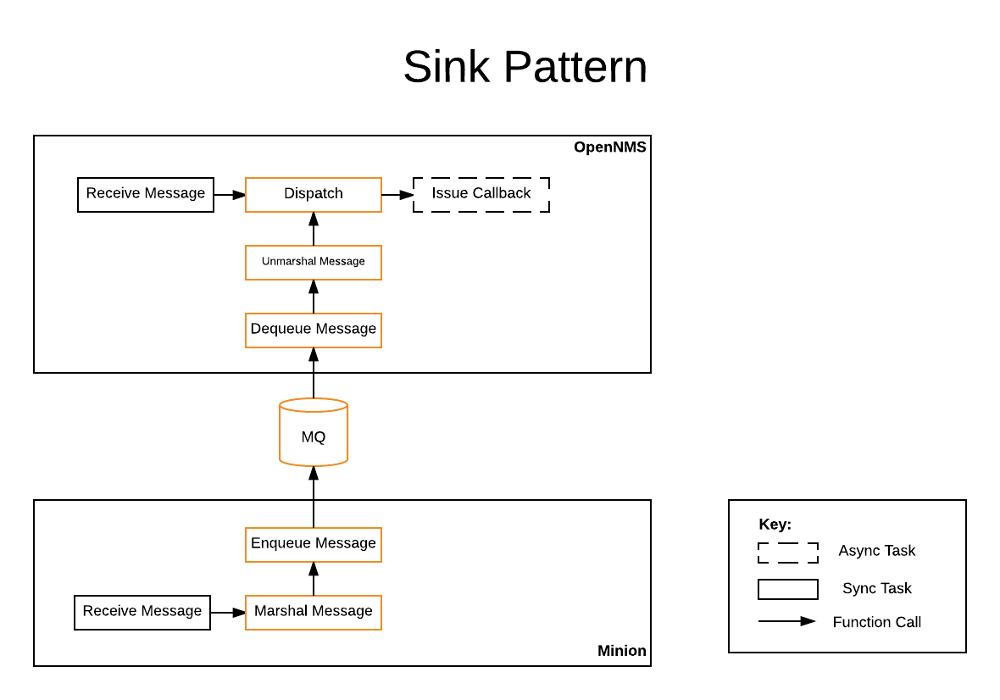
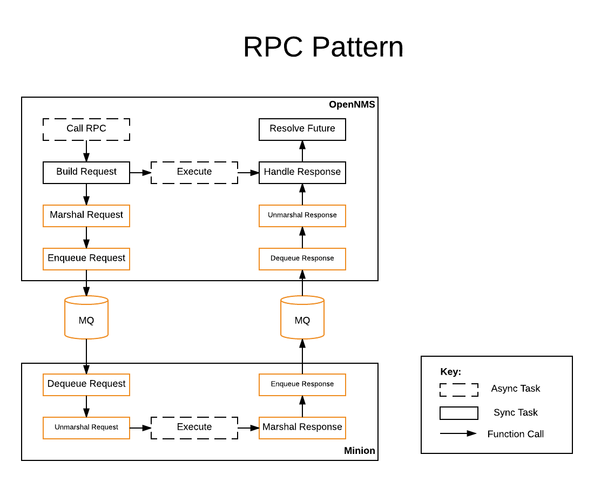

# Inter Process Communication (IPC)

## Goal

Understand how the components of the stack communicate and how they can be secured.

## APIs

Processes currently communicate using two patterns:
1) Remote procedure calls (RPCs)
2) Sinks (for unsolicited messages)

OpenNMS provides high level APIs for the RPC and Sink patterns.
The APIs are implemented using different messaging subsystems including JMS (ActiveMQ), Kafka, Amazon SQS and gRPC.

## Sink API

### Overview

Sinks are used for handling unsolicited messages from NEs that actively initiate connections.
These include SNMP traps, Syslog, Netflow, BMP, etc...
The Sink API is intented to make it easy to fire off messages, abstracting whether or not they are processed locally or remotely.
Here is an example where Syslog messages are dispatched for processing after being received from the UDP socket: [SyslogReceiverCamelNettyImpl.java#L175](https://github.com/OpenNMS/opennms/blob/opennms-26.2.2-1/features/events/syslog/src/main/java/org/opennms/netmgt/syslogd/SyslogReceiverCamelNettyImpl.java#L175)

### Description

Here is an overview of the JMS implementation of the Sink pattern:

The Sink API allows for code running within the context of either OpenNMS or Minion to forward unsolicited messages to one or more registered handlers.
If running on a Minion, the messages are forwarded back to the OpenNMS instance before invoking the handlers, whereas the handlers are invoked directly when the messages are generated within the OpenNMS instance itself.
The main object in this API is the SinkModule which defines the message type, how the message is marshaled and unmarshaled, and a series of policies to control how the producers and consumers should behave.
The AggregationPolicy defines how messages can be combined and provides criteria that define when they should be released.
The AsyncPolicy defines how the characteristics of the asynchronous producer including an upper limit on how many messages can be queued in memory, what to do with messages when this limit is reached, and how many background threads should be used to drain the queue.
In order to send a message, the sender must first obtain a dispatcher from the MessageDispatcherFactory while passing a reference to the SinkModule.
The sender can choose to create a synchronous dispatcher, that will block until the message is successfully sent, or an asynchronous dispatcher that will return immediately.
To handle messages, you must register a MessageConsumer with the MessageConsumerManager.

### JMS Implementation

The JMS implementation dispatches and consumes messages from a queue named:  "OpenNMS.Sink.${Sink Module Name}"

### Kafka Implementation

The Kafka implementation dispatches and consumes messages from a topic named: "OpenNMS.Sink.${Sink Module Name}"

## RPC API

### Overview

RPCs are used when triggering actions or active tests against NEs.
For example, executing a monitor, collector, detector, ping, etc...
The RPC API is intented to make it easy to invoke remote operations, abstracting whether or not they are local or remote.
Depending on the location of the NE, the requests are dispatched to different queues or executed locallly.
Here is an example where we execute a ping sweep at a remote location: [DiscoveryTaskExecutorImpl.java#L136](https://github.com/OpenNMS/opennms/blob/opennms-26.2.2-1/features/discovery/src/main/java/org/opennms/netmgt/discovery/DiscoveryTaskExecutorImpl.java#L136)

### Description

Here is an overview of the JMS implementation of the RPC pattern:

The remote producer call (RPC) API allows code running within the OpenNMS instance to invoke methods at a target location.
The target location can be the current location, in which case the methods are executed locally, or a different location, in which case the calls are dispatched for remote execution.
The main object in this API is the RpcModule which defines the request and response objects, how these are marshaled and unmarshaled, and provides the execution routine.
In order to issue an RPC call, the caller must first obtain a client from the RpcClientFactory while passing a reference to the RpcModule.
In order to handle RPC requests on a Minion, the RpcModule must be exposed via the OSGi service registry.
The implementation will listen for these and route the requests accordingly.

### TTL Handling
The TTL mechanism ensures that clients get a response back within a given time-frame. This response may be the result of the call, if successful, or an exception indicating that no client has processed the request before it expired.
In certain cases it is possible to calculate an upper bound on time taken to complete a task (i.e. ping a given IP address using a timeout of 2 seconds with 2 retries), however in many other cases it is not. For example, performing an SNMP walk on some OID could return almost instantly, or take several minutes depending the number of entries in the sub-tree.
The TTL can be specified in each request by the client, or it may be calculated by the module. In cases where no TTL is specified, a (configurable) global default is used.
When a particular call occurs on a recurring schedule (i.e. invoke this monitor every 5 minutes) we can also use the interval (5 minutes in this case) as the TTL.

> Meta-data can be used for to defined explicit TTLs on certain elements or services, while falling back to global defaults for other elements.

### JMS Implementation

The JMS implementation performs bidirectional communication over request and reply queues.
For every registered RpcModule the Minion will create one or more consumers against a queue named "OpenNMS.${Location}.RPC.${RPC Module Name}".
When executing a call at at remote location, the message will be placed on the appropriate queue, and a new temporary queue will be created, awaiting the reply.
If multiple Minions are active at a given location, they will operate in a competing consumer fashion, handling messages from the queue as quickly as they can be processed.

### Kafka Implementation

The Kafka implementation uses seperate topics for requests and replies
Minions consumer from the request topic, and share the same consumer group so that messages are only processed by a single Minion.
Responses are placed to the reply topic.

## Security

When deploying the messaging infrastructure for IPC it is important to consider isolating the topics or queues used by the different locations or tenants.
Without protections in place it would be possible for Minions at Location A to read, or craft requests destined for Location B.

The distribution of ActiveMQ that is embedded in OpenNMS includes authorization rules intended to help secure Minion deployments.
The [authorization entries](https://github.com/OpenNMS/opennms/blob/opennms-26.2.2-1/opennms-base-assembly/src/main/filtered/etc/opennms-activemq.xml#L45) are built such that Minions cannot write to other request queues, or read from other response queues.

## Lab - New RPC Module

Walk through the process of adding a new RPC module that can be used to retrieve SSL certificates: given a hostname and port, elastblish an SSL session and return the server certificate.

1. Create Maven module
1. Create RPC module class
1. Create RPC client classes
1. Wire using Spring
1. Wire using Blueprint
1. Define feature for Minion
1. Write Karaf shell command to trigger the client
